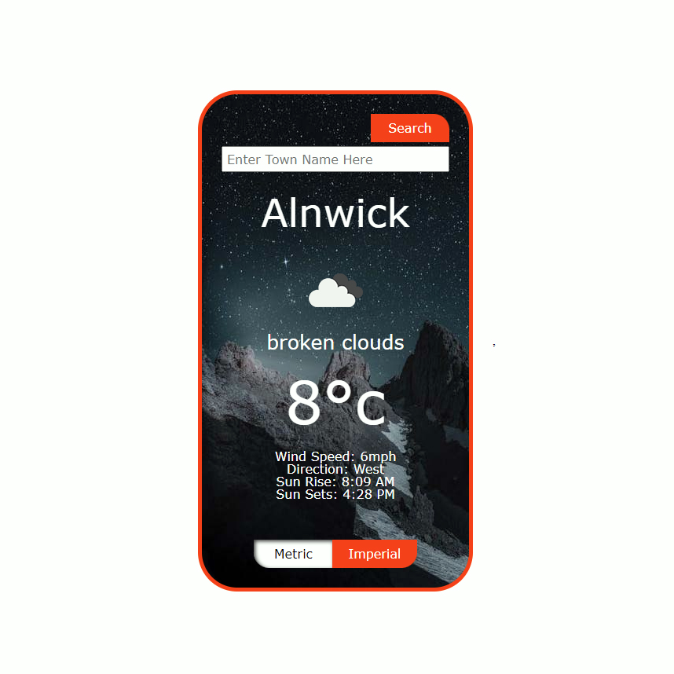

# Open Weather App

## Description

Open weather app is an application I built to learn about working with api.
It's been a fun little project and certainly helped my understanding of some things I was struggling with including:
- useEffect
- Ternary Operators
- Redux Toolkit

I suspect that my code could be vastly improved, and would absolutely love some feedback and areas to improve :)

## Objective

My aim was to work with open weather api, allow a user to perform a search and return the data relevant to that search.
I built this with a user in mind, who just wants a fast real time reading of the current weather in a given location.
This app will be rendered in the users browser.

## Screen Shots

## Acknowledgment

Eberhard Grossgasteiger (Photographer) for the fantastic photo used as a background
https://www.pexels.com/@eberhardgross

## Project status

I would love to have the background image of the application change based on both the time of day and the current weather.
At this stage I have not implemented any testing
